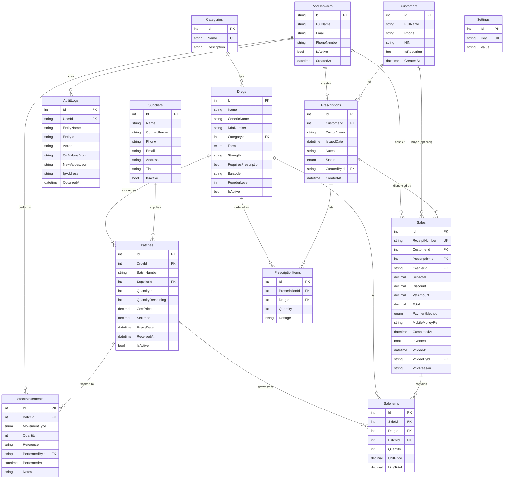

# MediStock — Database ERD

The full schema as 14 logical tables (Identity manages 6 of these — `AspNetUsers`, `AspNetRoles`, `AspNetUserRoles`, `AspNetUserClaims`, `AspNetUserLogins`, `AspNetUserTokens` — only the application tables are shown below). The diagram renders directly on GitHub via Mermaid.

## Notes

- **All decimal fields** are stored as `TEXT` in SQLite (via EF Core
  `HasConversion<string>()`) to preserve precision for monetary values.
- **`Sales.ReceiptNumber`** is unique. Format: `R-{yyyy}-{NNNNNN}` produced by
  the singleton `SqliteReceiptNumberGenerator`.
- **`Settings.Key`** is unique; values are arbitrary strings parsed at read
  time. Current keys: `Pharmacy.Name`, `Pharmacy.Address`, `Pharmacy.Phone`,
  `Pharmacy.Currency`, `Tax.VatRate`.
- **FIFO dispense:** when a sale is made, the `Batches` query orders by
  `ExpiryDate` ascending, so the earliest-expiry stock drains first.
- **Audit log** captures every state-changing action. `OldValuesJson` is
  `null` for `Create`; `NewValuesJson` is the post-state for every action.
